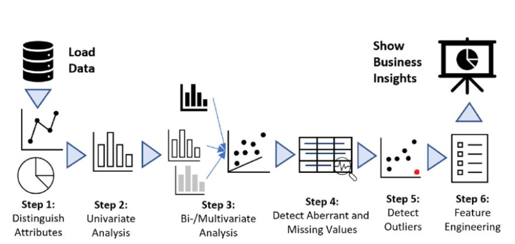

# Exploratory Data Analysis: Unveiling Insights with Data



This project emphasizes the power of exploratory data analysis (EDA) to uncover patterns, trends, and insights within datasets. By following a structured approach, it enables data enthusiasts to better understand and visualize data for meaningful insights.

---

## Features

- **Comprehensive EDA**:
  - Understand data distributions, missing values, and outliers.
  - Identify correlations and relationships between variables.
- **Visualization Tools**:
  - Generate intuitive visualizations like histograms, box plots, scatter plots, and heatmaps.
- **Structured Notebook**:
  - A step-by-step Jupyter Notebook (`EDA.ipynb`) guides users through the EDA process.
- **Dataset Included**:
  - Comes with a sample dataset (`possum.csv`) for hands-on practice.
- **Customizable Analysis**:
  - Easily adaptable for other datasets and EDA tasks.

---

## Tools and Libraries

The project leverages the following tools and libraries:
- **Python**: Core language for data analysis.
- **Pandas**: For data manipulation and cleaning.
- **Matplotlib & Seaborn**: For creating insightful visualizations.
- **Jupyter Notebook**: Interactive environment for running the EDA workflow.

---

## Dataset

The included sample dataset (`possum.csv`) provides a basis for practicing EDA techniques.

### Dataset Overview:
- **Rows**: Observations of individual possums.
- **Columns**: Attributes such as species, location, age, weight, and various body measurements.

### Key Fields:
- **Species**: The species of the possum (e.g., pygmy, ringtail).
- **Location**: The geographic location where the possum was observed.
- **Body Measurements**: Data on length, weight, and other physical characteristics.

### Sample Structure:

| ID | Species   | Location  | Age | Weight | Head_Length | Tail_Length | ... |
|----|-----------|-----------|-----|--------|-------------|-------------|-----|
| 1  | Ringtail  | Australia | 2   | 1.5    | 15.2        | 18.7        | ... |
| 2  | Pygmy     | Australia | 1   | 0.8    | 10.5        | 12.3        | ... |

---

## Results

This project allows users to:
- **Analyze Trends**:
  - Identify meaningful relationships between attributes.
  - Observe trends within the dataset.
- **Visualize Insights**:
  - Generate easy-to-interpret visualizations for presentations or reports.
- **Inform Decisions**:
  - Use findings to support data-driven decision-making.

---

## Installation

To set up the project locally, follow these steps:

1. Clone the repository:
   ```bash
   git clone https://github.com/teckyonAI/Exploratory_Data_Analysis.git

2. Navigate to the project directory:
   ```bash
   cd Exploratory_Data_Analysis

3. Ensure you have Jupyter Notebook installed:
    ```bash
    pip install notebook pandas matplotlib seaborn

4. Open the notebook:
    ```bash
    jupyter notebook EDA.ipynb

---

## Usage

1. Open `EDA.ipynb` in Jupyter Notebook.
2. Load the provided dataset (`possum.csv`).
3. Follow the notebook to:
     - Analyze data distributions.
     - Generate visualizations for key insights.
     - Identify patterns and relationships in the dataset.

---

## Contribution

Contributions are welcome! Here's how you can contribute:
1. Fork the repository.
2. Create a new branch for your feature or bug fix.
3. Submit a pull request with a detailed explanation of the changes.

